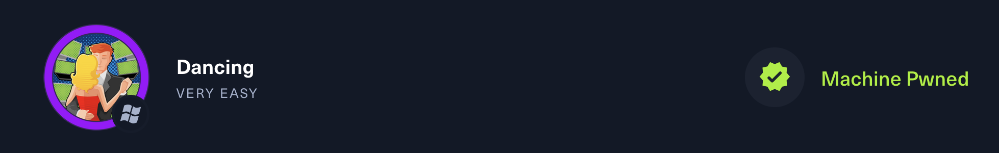

# Dancing



---

## :fontawesome-solid-computer: Machine information

* :material-server-security: **Machine:** Dancing
* :simple-hackthebox: **Platform:**  HackTheBox
* :fontawesome-brands-windows: **Operating system:** Windows
* :fontawesome-solid-brain: **Difficulty:** Very easy
* :material-tools: **Used tools:**  `nmap`, `ping`
* :material-ip-network: **IP address:** 
* :octicons-cross-reference-16: **Study topics:**
    - [Internet Control Message Protocol (ICMP)](https://hollowdragonx.github.io/cybersecurity-notes/)
    - [Network Enumeration with Nmap](https://hollowdragonx.github.io/cybersecurity-notes/network-enumeration/nmap/nmap-cheatsheet/)

---

## :material-note-text: Write up

---

## :fontawesome-solid-tasks: Task resolution

### Task 1

**Task**

```
What does the 3-letter acronym SMB stand for? 
```

**Answer**
```
Server Message Block 
```

### Task 2
**Task**

```
What port does SMB use to operate at? 
```

**Answer**
```
445
```

### Task 3

**Task**

```
What is the service name for port 445 that came up in our Nmap scan? 
```

**Answer**
```
microsoft-ds 
```


### Task 4

**Task**

```
What is the 'flag' or 'switch' that we can use with the smbclient utility to 'list' the available shares on Dancing? 
```

**Answer**
```
-L
```


### Task 5

**Task**

```
How many shares are there on Dancing? 
```

**Answer**
```
4
```


### Task 6

**Task**

```
What is the name of the share we are able to access in the end with a blank password? 
```

**Answer**
```
WorkShares
```


### Task 7

**Task**

```
What is the command we can use within the SMB shell to download the files we find? 
```

**Answer**
```
get
```
