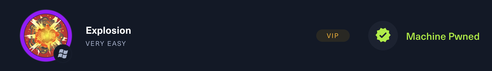

# Explosion



---

## :fontawesome-solid-computer: Machine information

* :material-server-security: **Machine:** Explosion
* :simple-hackthebox: **Platform:**  HackTheBox
* :fontawesome-brands-windows: **Operating system:** Windows
* :fontawesome-solid-brain: **Difficulty:** Very easy
* :material-tools: **Used tools:**  `nmap`, `ping`
* :material-ip-network: **IP address:** 
* :octicons-cross-reference-16: **Study topics:**
    - [Internet Control Message Protocol (ICMP)](https://hollowdragonx.github.io/cybersecurity-notes/)
    - [Network Enumeration with Nmap](https://hollowdragonx.github.io/cybersecurity-notes/network-enumeration/nmap/nmap-cheatsheet/)

---

## :material-note-text: Write up

---

## :fontawesome-solid-tasks: Task resolution

### Task 1

**Task**

```
What does the 3-letter acronym RDP stand for?
```

**Answer**
```
Remote Desktop Protocol
```

### Task 2
**Task**

```
What is a 3-letter acronym that refers to interaction with the host through a command line interface?
```

**Answer**
```
CLI
```

### Task 3

**Task**

```
What about graphical user interface interactions?
```

**Answer**
```
GUI
```


### Task 4

**Task**

```
What is the name of an old remote access tool that came without encryption by default and listens on TCP port 23?
```

**Answer**
```
telnet
```


### Task 5

**Task**

```
What is the name of the service running on port 3389 TCP? 
```

**Answer**
```
ms-wbt-server
```


### Task 6

**Task**

```
What is the switch used to specify the target host's IP address when using xfreerdp?
```

**Answer**
```
/v:
```


### Task 7

**Task**

```
What username successfully returns a desktop projection to us with a blank password?
```

**Answer**
```
Administrator
```


