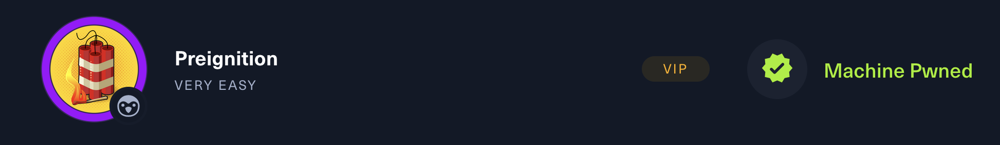

# Preignition



---

## :fontawesome-solid-computer: Machine information

* :material-server-security: **Machine:** Preignition
* :simple-hackthebox: **Platform:**  HackTheBox
* :simple-linux: **Operating system:** Linux
* :fontawesome-solid-brain: **Difficulty:** Very easy
* :material-tools: **Used tools:**  `nmap`, `ping`
* :material-ip-network: **IP address:** 
* :octicons-cross-reference-16: **Study topics:**
    - [Internet Control Message Protocol (ICMP)](https://hollowdragonx.github.io/cybersecurity-notes/)
    - [Network Enumeration with Nmap](https://hollowdragonx.github.io/cybersecurity-notes/network-enumeration/nmap/nmap-cheatsheet/)

---

## :material-note-text: Write up

---

## :fontawesome-solid-tasks: Task resolution

### Task 1

**Task**

```
Directory Brute-forcing is a technique used to check a lot of paths on a web server to find hidden pages. Which is another name for this? (i) Local File Inclusion, (ii) dir busting, (iii) hash cracking.
```

**Answer**
```
dir busting
```

### Task 2
**Task**

```
What switch do we use for nmap's scan to specify that we want to perform version detection
```

**Answer**
```
-sV
```

### Task 3

**Task**

```
What does Nmap report is the service identified as running on port 80/tcp?
```

**Answer**
```
http
```


### Task 4

**Task**

```
What server name and version of service is running on port 80/tcp?
```

**Answer**
```
nginx 1.14.2
```


### Task 5

**Task**

```
What switch do we use to specify to Gobuster we want to perform dir busting specifically?
```

**Answer**
```
dir
```


### Task 6

**Task**

```
When using gobuster to dir bust, what switch do we add to make sure it finds PHP pages?
```

**Answer**
```
-x php
```


### Task 7

**Task**

```
What page is found during our dir busting activities?
```

**Answer**
```
admin.php
```


### Task 8

**Task**

```
What is the HTTP status code reported by Gobuster for the discovered page?
```

**Answer**
```
200
```